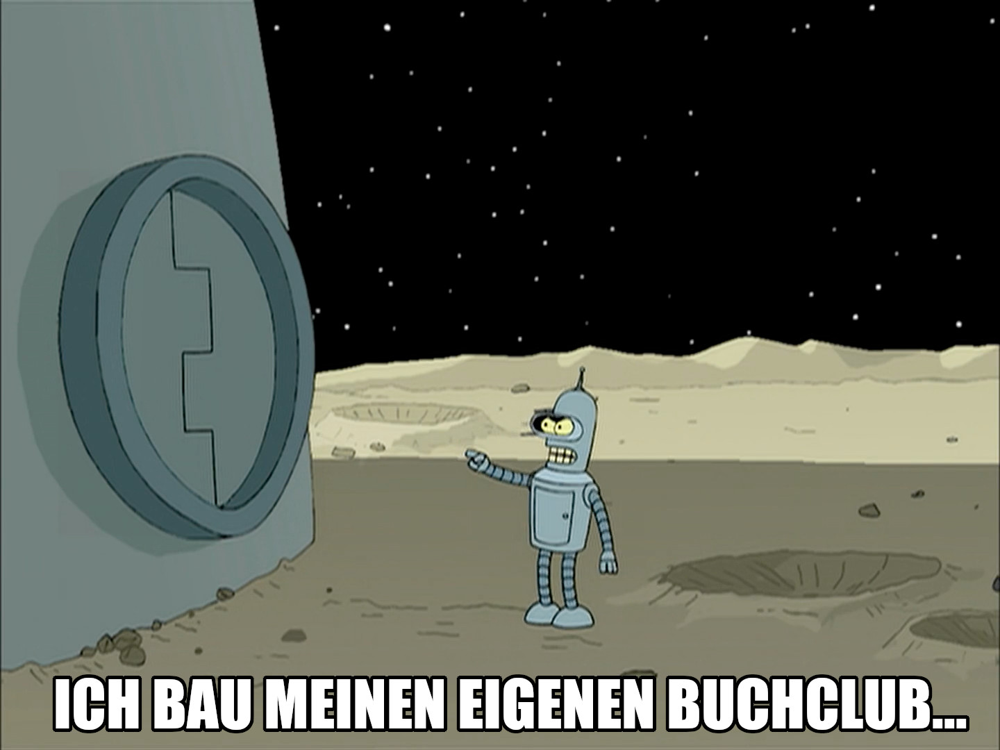

# Buchclub Trostberg

die meisten bücher sind scheisse!  
wir suchen die wenigen ausnahmen,  
und tauschen unsere zusammenfassungen.  
ein buchclub eben : )

weil öffentliche büchereien sind "totzensiert"  
(die wenigen guten bücher findet man dort sicher nicht)  
(und in der schule gibts auch nur scheiss bücher...)

weil bücherlesen kostet zeit (auch mit speed reading)  
und mehr menschen schaffen mehr bücher

"die wenigen ausnahmen"  
hier ein paar beispiele:  
https://github.com/milahu/books

nicht erwünscht sind:  
fantasy bücher  
science fiction bücher  
"laberflash bücher" die viel reden aber nichts sagen  
kochbücher  
"diagnose ohne therapie" bücher (passives rumheulen)  
esoterik bücher ("mind over matter", eskapismus)  
...

aka: Offline Stammtisch Trostberg

aka: was soll man machen MIT 10000 nachbarn?

aka: wie kommen wir von "nebeneinander" zu "miteinander"?

wann und wo?  
wir treffen uns ein mal pro woche, irgendwo...

wie?  
ein bisschen wie "speed dating"  
also wir bilden mehrere zweiergruppen  
und wer reden will der redet, und wer hören will der hört  
(nicht jeder passt zu jedem, also wir müssen erstmal rausfinden, wer passt überhaupt zusammen?)

in dem sinn:  
wir bauen unseren eigenen buchclub, mit blackjack und nutten!  
noch schnell vor dem weltuntergang : )

---

https://www.kleinanzeigen.de/s-anzeige/buchclub-trostberg/3461566139-187-5698
